+++
title = "DNS: Privacy and Security Considerations"
outputs = ["Reveal"]
+++

## 📢 DNS 📨

#### Privacy and Security Considerations

---

$ whoami

- Participate in organising NCSG
- _still_ a terrible public speaker - but we'll push through!

---

This presentation isn't highly advanced or technical

Do feel free to ask questions at any point 🤔

---

I may respond to a question asking you to hold it

I will only do this if we will cover it in later slides 🙇

---

Agenda ⚡️

- what is DNS?
- why is _most_ vanilla DNS problematic?
- why would we care?
- what could we do?

{}
There is 29 slides to get through; I'm going to do my best to go fast
{}

---

Before we start; threat modelling!

---

Tonight I'll assume we are not defending against highly complex adversaries

Simple or limited resources only 🥸

{}
Note that we won't be covering adversaries with full network flow visibility
or modification capabilities

Simply opportunistic adversaries that _could_ see partial flows or in a worst case: complete flows,
but lack judicial or law enforcement backing

If those are your adversaries; this in isolation won't protect you
{}

---



---

## What is DNS?

Domain Name System;

Also commonly referred to as the internet phonebook

---

DNS generally will utilise UDP 🗣

Where a packet requires it, it may use TCP

{}
This design was excellent for it's time; Early networks however quickly reached
limits utilising centralised tables for hostname to numerical addresses.

The Internet Engineering Task Force published the original DNS specifications
RFC 882 and 883 in 1983, with an update RFC 973 in 1986
{}

---

## Why is most standard DNS problematic?

{}
The basic design of DNS was from a time in which we weren't worried
about the Ghost in the Wires.

We started to see the emergence of more traditional hacking as we
know it today, but it was certainly not taken as seriously
{}

---

The most basic implementations of DNS

- {}are not encrypted{}
- {}don't enable validation of responses{}

---

An extremely simplified flow

---

This flow could be modified or viewed

```mermaid
flowchart LR
    A[Device] -->|Request DNS Resolution| B[Adversary]
    B -.->|Request DNS Resolution| C[DNS Server]
    C -.->|Return IP Address | B
    B -->|Return IP Address 🥸| A
```

{}
Right hand side is optional
{}

---

A more real-world flow of DNS


flowchart LR
A[Device] -->|Request DNS Resolution| B[Local Resolver]
B -->|Query Cache| C{Cache Hit?}
C -->|Yes| D[Return IP Address]
C -->|No| E[Forward DNS Query]
E --> F[Root DNS Server]
F -->|Return TLD DNS Server| G[TLD DNS Server]
G -->|Return Authoritative DNS Server| H[Authoritative DNS Server]
H -->|Return IP Address| D
D -->|Response to User Device| A


{}

- Device
- Query local cache
- If a hit, return that value
- Otherwise, Forward query to configured DNS server
- That server then will query the root DNS server
- The root server will return a top level domain server
- Which in turn returns an authoritative server
- Which finally will return a response to the requester
  {}

---

## why would we care?

{}

- Confidentiality
- Integrity
  {}

---

## what could we do?

---

## DNSSEC

APNIC Blog on DNSSEC Adoption ^[1](https://blog.apnic.net/2023/09/18/measuring-the-use-of-dnssec/)^

{}
This resolves for integrity - we are confident in the response,
but not confidentiality.

We also can estimate that given the APNIC publication
from 2023; that a large portion of websites haven't yet
adopted DNSSEC as a control; leaving us without an ability to
depend on this as a control
{}

---

## DoTLS & DOH

Will ensure the secrecy of queries, but not validate without DNSSEC ^[2](https://www.cloudflare.com/learning/dns/dns-over-tls/)^

---

You may well be utilising some of these options by default nowadays

---

Most common browsers all offer a form of DoH or DoTLS

Some even by default

---

| Browser       | DoH or DoTLS | Default |
| ------------- | ------------ | ------- |
| Brave         | ✅           | ❌      |
| Chromium      | ✅           | ❌      |
| Edge          | ✅           | ✅      |
| Firefox       | ✅           | ✅      |
| Google Chrome | ✅           | ❌      |
| Opera         | ✅           | ❌      |
| Vivaldi       | ❌           | ❌      |

---

Android (v9+^[3](https://android-developers.googleblog.com/2018/04/dns-over-tls-support-in-android-p.html)^) and iPhone (v14+^[4](https://rodneylab.com/how-to-enable-encrypted-dns-on-iphone-ios-14/)^) offer DoTLS as settings

---

Recap:

- ~what is DNS?~ ✅
- ~why is _most_ vanilla DNS problematic?~ ✅
- ~why would we care?~ ✅
- what could we do for devices we
  - ~can configure?~ ✅
  - cannot configure? 😈

{}
Check if there is time to cover the next section

Note to audience if we are going to explore how to (ab)use
local network devices to act as we want them to
{}

---



---

In settings we control the network; we can uplift our posture by
running our own resolver

---

---

Pihole

---

dnsmasq

---

Blocky

---

Who's familiar with NAT?

---

NAT (ab)use

{}
Some devices just do not behave inside a network - where suitable
we can NAT an internal call for external resources on port 53
back to an internal resource of choice

This is beneficial as we can better control the choices of controls
we apply across a whole network - even if some devices are not clearly configurable
{}

---

Questions?

---

Thanks!
