+++
title = "DNS: Privacy and Security Considerations"
outputs = ["Reveal"]
+++

## 📢 DNS 📨

#### Privacy and Security Considerations

---

$ whoami

- Participate in organising NCSG
- _still_ a terrible public speaker - but we'll push through!

---

This presentation isn't highly advanced or technical

Do feel free to ask questions at any point 🤔

---

I may respond to a question asking you to hold it

I will only do this if we will cover it in later slides 🙇

---

Agenda ⚡️

- what is DNS?
- why is _most_ vanilla DNS problematic?
- why would we care?
- what could we do?

---

## What is DNS?

Commonly referred to as the internet phonebook

---

DNS generally will utilise UDP 🗣

---

Where a packet requires it, it may use TCP

---

## Why is most standard DNS problematic?

---

The most basic implementations of DNS

- {}are not encrypted{}
- {}don't enable validation of responses{}

---

An extremely simplified flow

---

This flow could be modified or viewed

```mermaid
flowchart LR
    A[Device] -->|Request DNS Resolution| B[Adversary]
    B -.->|Request DNS Resolution| C[DNS Server]
    C -.->|Return IP Address | B
    B -->|Return IP Address 🥸| A
```

Right hand side is optional

---

A more real-world flow of DNS


flowchart LR
A[Device] -->|Request DNS Resolution| B[Local Resolver]
B -->|Query Cache| C{Cache Hit?}
C -->|Yes| D[Return IP Address]
C -->|No| E[Forward DNS Query]
E --> F[Root DNS Server]
F -->|Return TLD DNS Server| G[TLD DNS Server]
G -->|Return Authoritative DNS Server| H[Authoritative DNS Server]
H -->|Return IP Address| D
D -->|Response to User Device| A


---

## why would we care?

---

## what could we do?

---

A number of neat mechanisms may help in differing ways

---

## DNSSEC

Will ensure responses are correct, but not defend from observation

---

## DoTLS

Will ensure the secrecy of queries, but not validate without DNSSEC

---

## DOH

Will ensure the secrecy of queries, but not validate without DNSSEC

---

You may well be utilising some of these options by default nowadays

---

Firefox and Chromium derivatives all offer a form of DoH or DoTLS

---

Android (v9+) and iPhone (v14+) offer DoTLS as settings

---

🕳 🐇

---

Topics to cover:

- Daily use of more security options:
  - Browsers
  - Phones
  - OS Configurations
- Further reading
  - DNS Resolver solutions
  - (ab)use of NAT in ipv4
